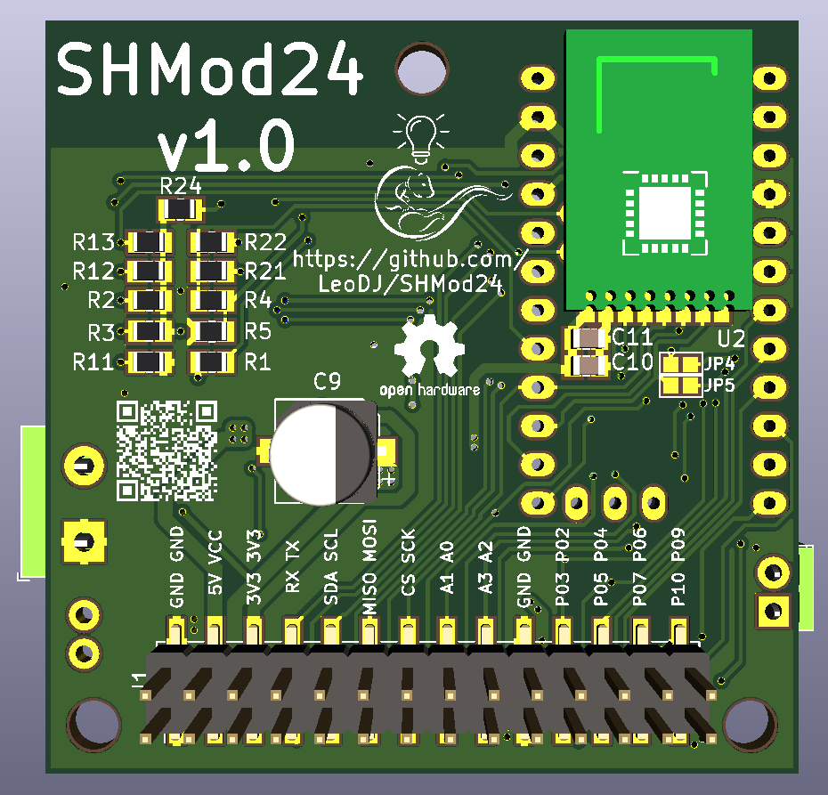

# SHMod24
(Smart Home Module NRF24)

WORK IN PROGRESS.

This PCB is a universal microcontroller board with many optionally placable components. It aims to be an universal base-board for many projects especially around home automation.

## Features
- Choice of ATMega328 (Arduino Pro Mini) or ESP8266 (ESP12-F) as the µC
- NRF24L01+ SMD with power filtering
- 6-30V input with buck converter
- Lithium battery support with charging and protection circuit
- 3.3V supply and logic
- Some MOSFET capable outputs
- RS485 Transceiver

|  |  |
|:---------------------|:----------------------|
|                  |                   |

## Pinout
The pinout of the 28 pin header is listed here:

| ESP8266                  | Arduino | Function | Pin    | Pin    | Function  | Arduino | ESP8266                  |
|:-------------------------|:--------|:---------|:-------|:-------|:----------|:--------|:-------------------------|
|                          |         | GND      | **1**  | **2**  | GND       |         |                          |
|                          |         | 5V       | **3**  | **4**  | VCC       |         |                          |
|                          |         | 3.3V     | **5**  | **6**  | 3.3V      |         |                          |
| RX                       | RX      | RX       | **7**  | **8**  | TX        | TX      | TX                       |
| GPIO4                    | A4      | SDA      | **9**  | **10** | SCL       | A5      | GPIO5                    |
| GPIO12                   | 12      | MISO     | **11** | **12** | MOSI      | 11      | GPIO13                   |
| GPIO15                   | 8       | CS       | **13** | **14** | SCK       | 13      | GPIO14                   |
|                          | A1      |          | **15** | **16** | Analog in | A0      | ADC (0-3.3V)             |
|                          | A3      |          | **17** | **18** |           | A2      |                          |
|                          |         | GND      | **19** | **20** | GND       |         |                          |
| GPIO2                    | 3       | MOSFET   | **21** | **22** |           | 2       | GPIO0                    |
| [GPIO13]* JP4 | 5       | MOSFET   | **23** | **24** |           | 4       |                          |
| GPIO16                   | 7       | NRF_CE   | **25** | **26** | MOSFET    | 6       | [GPIO12]* JP5 |
|                          | 10      | MOSFET   | **27** | **28** | MOSFET    | 9       |                          |

*) GPIO can be connected to this pin by bridging the mentioned jumper

**ATTENTION:** When the MAX3485 is mounted the Arduino doesn't want to be programmed most of the time. So make sure to pull pin P3 either to GND or to 3.3V, it doesn't like floating.
## BOM
There are multiple different module groups that can be populated.

 **Information about what to watch out for for the different module groups will follow.**

 In the table is listed, which components to populate for a given module:

| Module                   | Reference            | Part                              |
|:-------------------------|:---------------------|:----------------------------------|
| **ESP8266**              | U1                   | ESP8266 12F                       |
|                          | R1, R2, R3, R11, R24 | 10k                               |
| ESP8266 ADC              | R4                   | 220k                              |
|                          | R5                   | 100k                              |
|                          |                      |                                   |
| **Arduino**              | IC1                  | Arduino Pro Mini                  |
|                          |                      |                                   |
| **NRF radio**            | U2 or U7             | NRF24L01+ SMD                     |
|                          | C11                  | 100nF                             |
|                          | (C10)                | 10µF                              |
|                          |                      |                                   |
| **3.3V regulator**       | U3                   | AP2112K                           |
|                          | C1, C2               | 1µF                               |
|                          |                      |                                   |
| **Buck regulator**       | U6                   | LMR14010A                         |
|                          | R9                   | 56k                               |
|                          | R10                  | 10k                               |
|                          | C8                   | 2.2µF 50V                         |
|                          | C8                   | 22µF                              |
|                          | D1                   | Schottky 40V SMA                  |
|                          | L1                   | 22µH                              |
|                          | C6                   | 100n                              |
|                          | (C9)                 | 100µF                             |
|                          |                      |                                   |
| **LiPo charger**         | U4                   | TP4056                            |
|                          | R6                   | 2k2                               |
|                          | C5                   | 100nF                             |
|                          | R14                  | 1k                                |
|                          | D2                   | 0805 SMD LED (charging indicator) |
|                          |                      |                                   |
| **LiPo protection**      | U5                   | DW01A                             |
|                          | Q1                   | FS8205A                           |
|                          | R7                   | 100                               |
|                          | R8                   | 1k                                |
|                          | C3                   | 100n                              |
|                          |                      |                                   |
| **I²C pullup resistors** | R12, R13             | 10k                               |
|                          |                      |                                   |
| **RS485 Transceiver**    | U8                   | MAX3485                           |

## Project installation
- Make sure to run `git clone` with `--recurse-submodules` to include the necessary libraries too.
- To use the 3D Models, set the following environment variables:
  - **ESPLIB** : `${KIPRJMOD}\lib_includes\kicad-ESP8266`
  - **MYSLOCAL** : `${KIPRJMOD}\lib_includes`
  - Note: Sometimes you need to manually replace `${KIPRJMOD}` with the absolute path to the project
