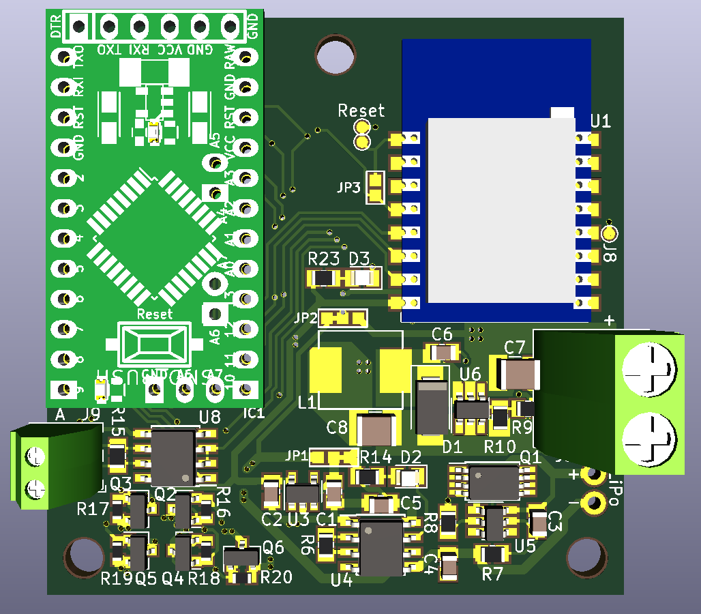

# SHMod24
(Smart Home Module NRF24)

WORK IN PROGRESS.

This PCB is a universal microcontroller board with many optionally placable components. It aims to be an universal base-board for many projects especially around home automation.

## Features
- Choice of ATMega328 (Arduino Pro Mini) or ESP8266 (ESP12-F) as the µC
- NRF24L01+ SMD with power filtering
- 6-30V input with buck converter
- Lithium battery support with charging and protection circuit
- 3.3V supply and logic
- Some MOSFET capable outputs
- RS485 Transceiver

|  |  |
| -------------------- | --------------------- |
|                  |                   |

## Pinout
The pinout of the 28 pin header is listed here:

| ESP8266                  | Arduino | Function | Pin    | Pin    | Function  | Arduino | ESP8266                  |
| :----------------------- | :------ | :------- | :----- | :----- | :-------- | :------ | :----------------------- |
|                          |         | GND      | **1**  | **2**  | GND       |         |                          |
|                          |         | 5V       | **3**  | **4**  | VCC       |         |                          |
|                          |         | 3.3V     | **5**  | **6**  | 3.3V      |         |                          |
| RX                       | RX      | RX       | **7**  | **8**  | TX        | TX      | TX                       |
| GPIO4                    | A4      | SDA      | **9**  | **10** | SCL       | A5      | GPIO5                    |
| GPIO12                   | 12      | MISO     | **11** | **12** | MOSI      | 11      | GPIO13                   |
| GPIO15                   | 8       | CS       | **13** | **14** | SCK       | 13      | GPIO14                   |
|                          | A1      |          | **15** | **16** | Analog in | A0      | ADC (0-3.3V)             |
|                          | A3      |          | **17** | **18** |           | A2      |                          |
|                          |         | GND      | **19** | **20** | GND       |         |                          |
| GPIO2                    | 3       | MOSFET   | **21** | **22** |           | 2       | GPIO0                    |
| [GPIO13]* JP4 | 5       | MOSFET   | **23** | **24** |           | 4       |                          |
| GPIO16                   | 7       | NRF_CE   | **25** | **26** | MOSFET    | 6       | [GPIO12]* JP5 |
|                          | 10      | MOSFET   | **27** | **28** | MOSFET    | 9       |                          |

*) GPIO can be connected to this pin by bridging the mentioned jumper

## BOM
There are multiple different module groups that can be populated.

For now, the temporary BOM can be found [here](https://docs.google.com/spreadsheets/d/1iiKxV4PersgIiQVDc-0L7qx-AuePIFJ2Z4iP8jHeFN8). **Information about the different module groups will follow.**

## Project installation
- Make sure to run `git clone` with `--recurse-submodules` to include the necessary libraries too.
- To use the 3D Models, set the following environment variables:
  - **ESPLIB** : `${KIPRJMOD}\lib_includes\kicad-ESP8266`
  - **MYSLOCAL** : `${KIPRJMOD}\lib_includes`
  - Note: Sometimes you need to manually replace `${KIPRJMOD}` with the absolute path to the project